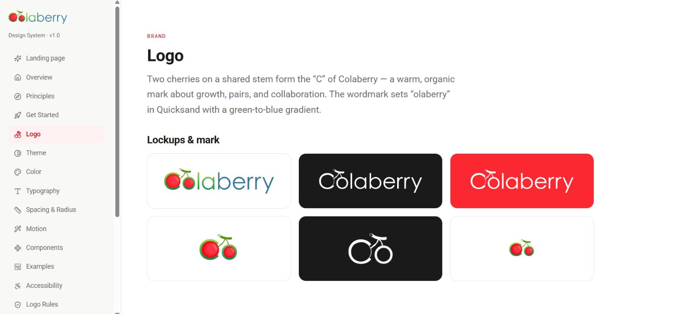
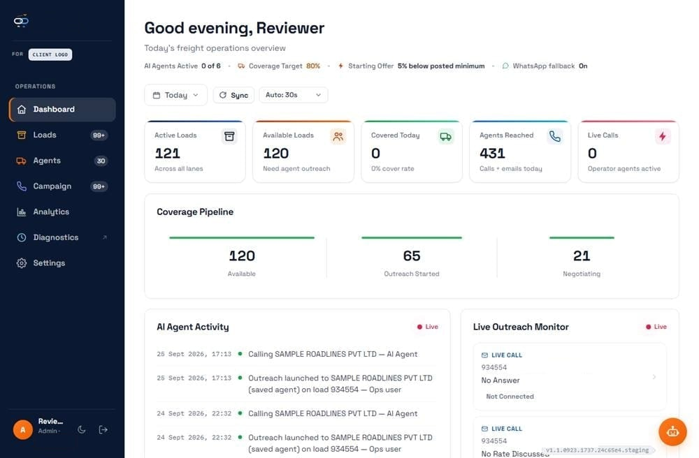
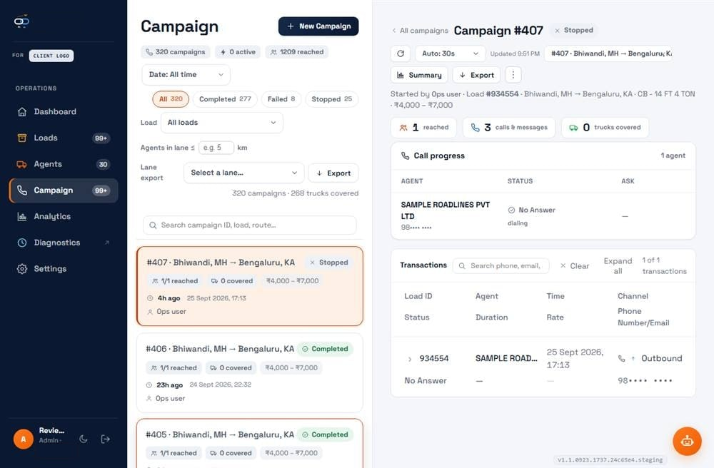
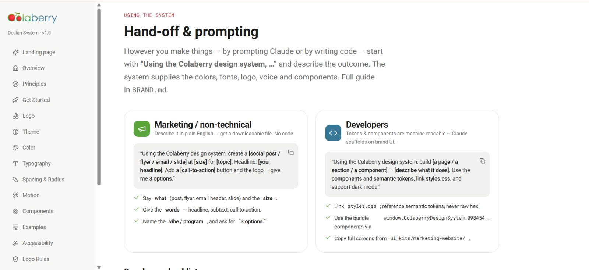

Fixture opening paragraph. Body copy stays inside the reading measure and uses the body line height.

## A second-level heading

Fixture paragraph with a [text link](/blog) and some `inline code`.

### A third-level heading

<Figure caption="Fixture caption for a single image.">

</Figure>

<Callout title="Fixture note">
Fixture callout text. A callout carries an icon and a title, so it never relies on colour alone.
</Callout>

<Callout tone="warning" title="Fixture warning">
Fixture warning text.
</Callout>

> Fixture block quote. A quote is set apart from the body text.

```md
# button.md
variant: primary | ink | secondary | ghost   (default primary)
a-deliberately-long-line-of-code-that-must-scroll-inside-its-own-box-and-never-widen-the-page: true
```

| Fixture column one | Fixture column two | Fixture column three | Fixture column four |
| --- | --- | --- | --- |
| Row one | A cell with a longer piece of text | 12 | an-unbroken-string-of-sixty-characters-that-is-not-a-link-x1 |
| Row two | Another cell | 34 | Short |

<Gallery>



</Gallery>

## Embeds

<YouTube id="aaaaaaaaaaa" title="Fixture video title" />

<LinkedInPost urn="urn:li:share:0000000000000000000" url="https://www.linkedin.com/in/aiuxaleem" title="Fixture LinkedIn post" excerpt="Fixture excerpt of the post, shown on the card before anything loads." />

<LinkedInArticle url="https://www.linkedin.com/in/aiuxaleem" title="Fixture LinkedIn article title" excerpt="Fixture excerpt of the article." date="2026-01-15" />
